# Practical Assignment #1 - The Acme Electronic Supermarket  

By:
- Bruno Mendes [up201906166](mailto:up201906166@up.pt)
- Fernando Rego [up201905951](mailto:up201905951)
- Gustavo Santos [up201907397](mailto:up201907397)
- José Costa [up201907216](mailto:up201907216)

## How to run

You may use the server by getting its dependencies and then firing up the Go application, with the MongoDB database up:

```bash
    docker-compose up -d
    go get .
    go run .
```

Then, fire up the Android application using your preferred method (we recommend sideloading with `Android Studio`). Since we did not deploy the web server in the cloud, make sure to change the server IP address in `res/values/string_config.xml` to your machine's.

## Overview

(UML simples da arquitetura)

We have developed two artifacts: an Android application and a web server to support its operations. The Android app, upon login, disambiguates to client or admin mode given the user type that is registered on the server.

### Customer App

The customer app starts by greeting the user with their accumulated balance, available to be used in purchases, and display their earned coupons, also to be used in purchases. If they want to, they can review their transaction history, which includes paid price and product list, on the `Receipts` tab of the bottom navigation bar.

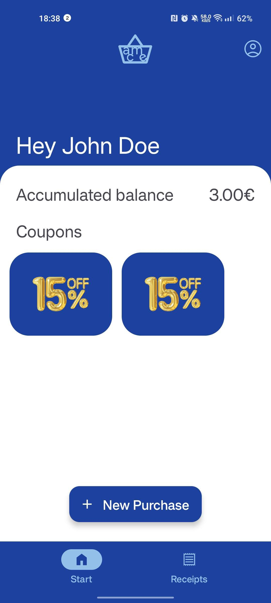
(imagem dos recibos)

Tapping `New Purchase`, the user may initiate a purchase and start scanning product QR codes, printed on the physical supermarket. When they are about to leave the supermarket, they should tap `Checkout`, choose whether to use available balance and coupons, and then conclude the operation by checking out on a terminal, with QR code or NFC.

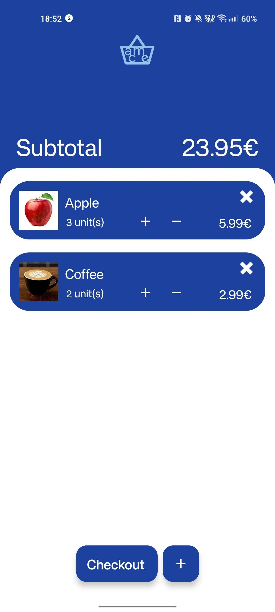
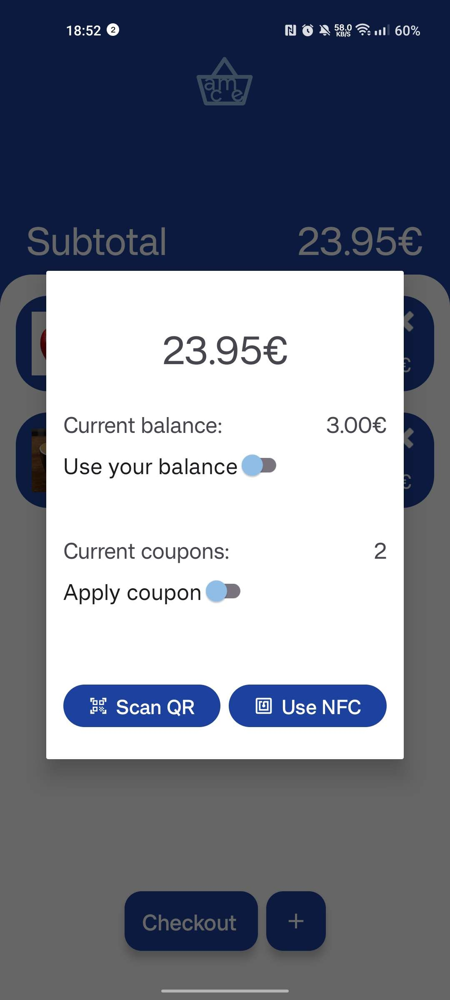
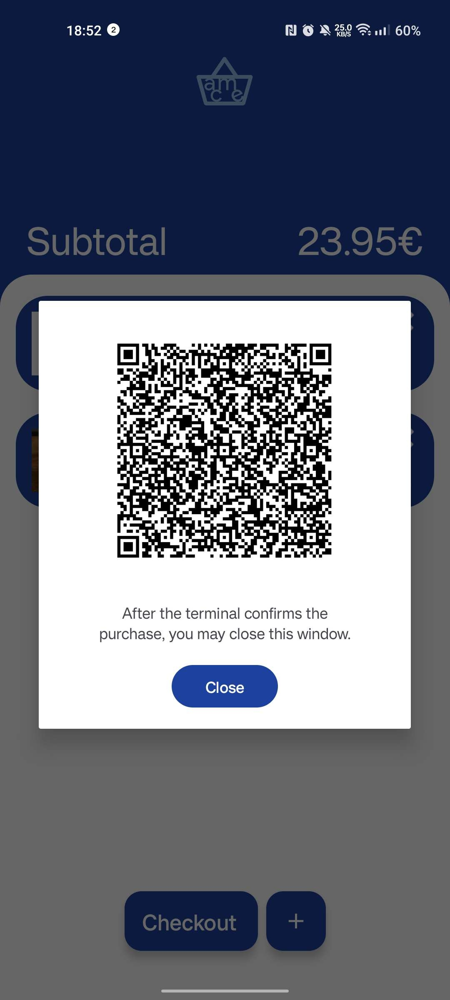
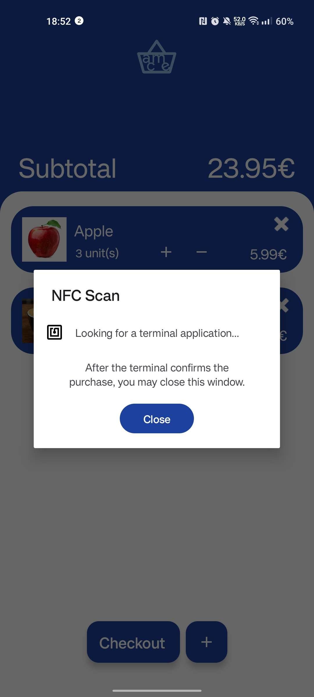

### Terminal App

The customer app is a more pragmatic one, allowing at the home page the generation of new supermarket products, with name, image and price, and respective QR codes.

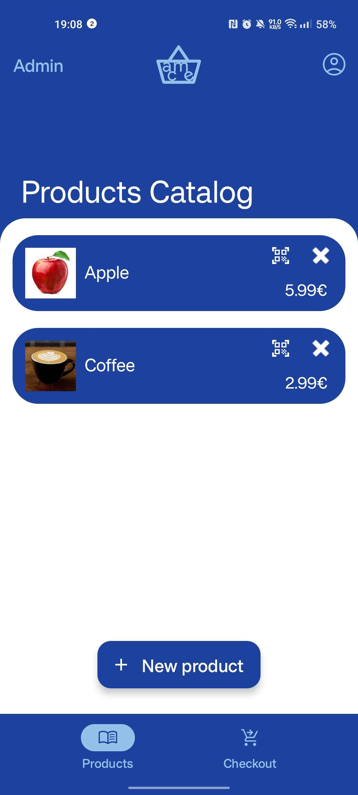
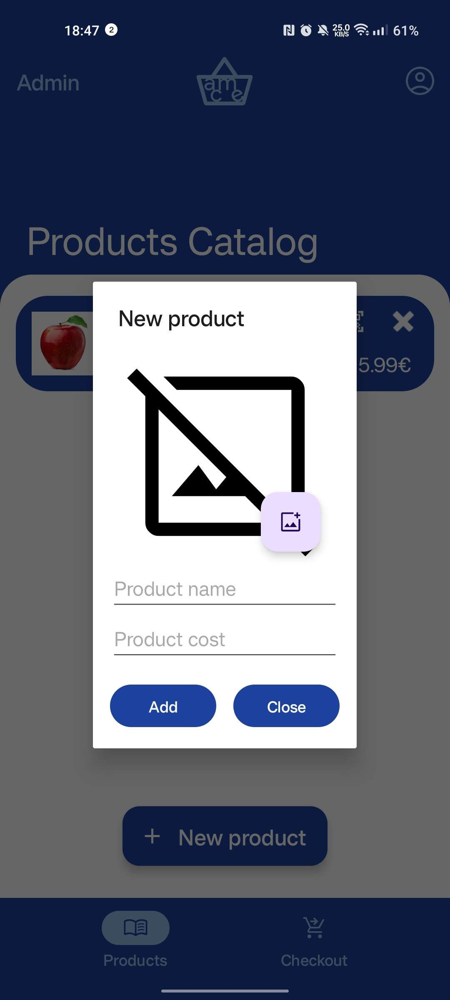
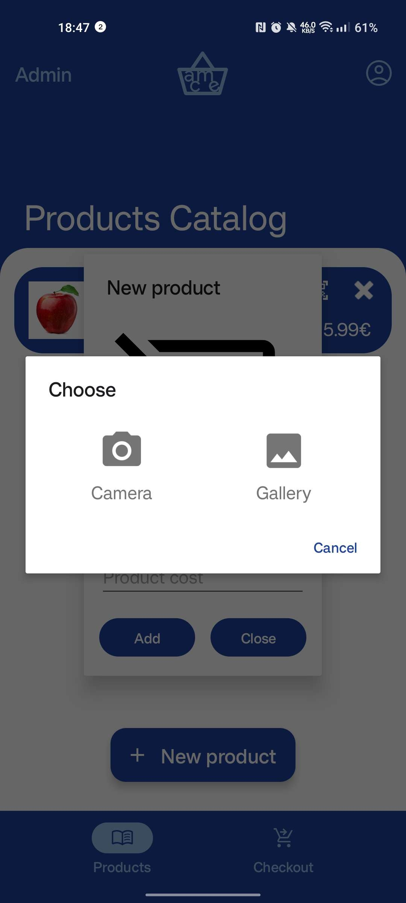
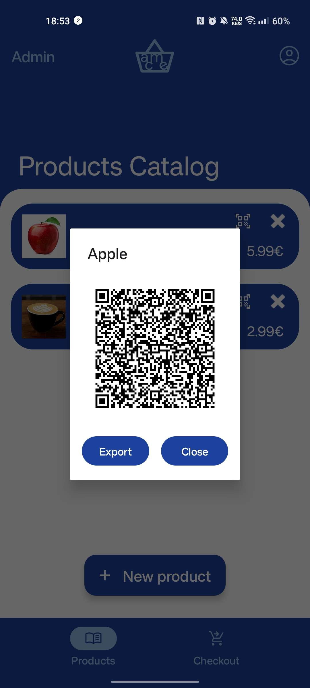

On the `Checkout` tab, the terminal is able to listen for a QR code or NFC purchase. After receiving the purchase payload from the client, it validates it with the server and displays a result message.

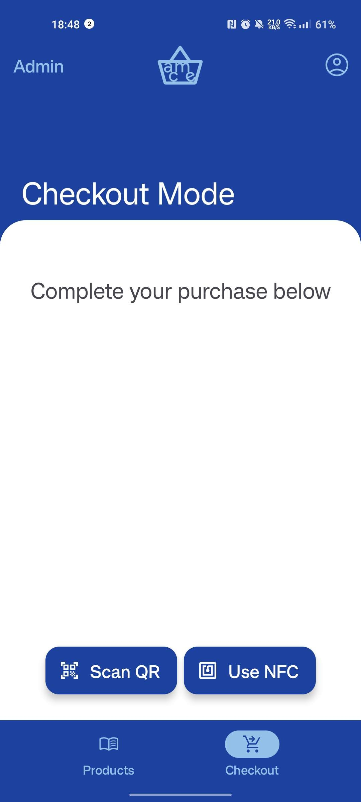
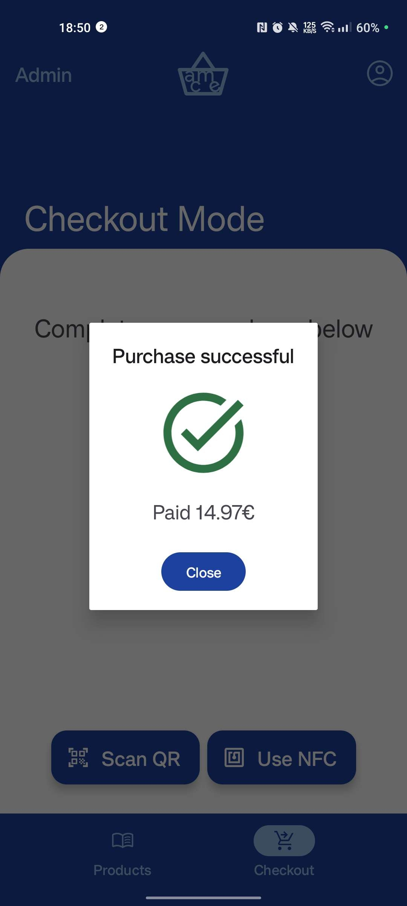

### Web Service
To support the several operations of the application, we developed a `REST` service using the *Go* language and also a non-relational database using *MongoDB*.

The server provides several endpoints that the application can use to add or retrieve information. This endpoints are divided by groups, each group with the right middlware to verify that the authentication used is valid to the correspondent request.

All the information needed for the application is stored into three database collections that can be represented by the following UML:
 


## Main Features

### Registration
Registering the user means registering them on the database, and allow their operations on the store to be persisted, which is great for both parties: the store has data ready to be used to predict customer behavior and the customer gets a glance of their past activity and current account status.
Due to the way we have implemented session with JWT (see below), this also allows the user to exchange phones and maintain their history.

### Adding to the shopping basket
In this digital future, it's the user's responsability to scan their products' references while picking them from the shelves. They can do so by scanning the QR codes printed all over the place in the market.

### Checkout
When they are ready to leave, the user must complete their purchase by using NFC or a QR code (containing transaction data) to validate it in the market terminals. The money will be extracted from their account (of course, this was not implemented, actually) and then the doors will open.

### Payment and Result
The terminal validates the purchase with the web server and displays a success message, with total amount paid (already discounting the coupons and balance), or an error message. In case of the latter, the customer should ask for the assitance of a human operator.

### Past Transactions and Coupons
The registered transactions in the server associated with the logged in user are available at all times. They include total amount paid and product list with quantity. The same can be said for available coupons.

### Coupons

### Cryptography
Sou o josé costa @sirze

## Additional Features

### NFC
Besides the mandatory primary means of performing a purchase checkout (using the QR code), we allow the user to checkout via NFC if they prefer so. In that mode, the terminal app enters reader mode, while the client app enters card emulation mode. The data exchange protocol, due to the small maximum size of a data packet, allows dividing the data in chunks (at the end of each packet transfer, the client appends `OK` or `MORE` so that the reader knows whether to consider the next packets as part of the purchase model or dispatch to the server immediately) and is resilient to errors (if the connection is broken, the next sent packet will be the first one again).

### JWT
In addition to the required encryption, we use JSON Web Tokens, that defines a self-contained way for securely transmitting information between parties. This is an additional layer of security on top of the encryption, but also allows us to uninstall the app and still use the same user with their history (we generate new keys upon login, not registration). Our JWT implementation includes an expiration after 1 week, after which the user is forced to do a relogin. Possible improvements could include adding a refresh token to the equation, which was considered overkill for the current scale of the project.

### Swipe to refresh
The feature swipe to refresh, using `SwipeRefreshLayout`, allows both client and admin to refresh the application and obtain the more recent information from the database. The client has the option to refresh the user information and the list of active coupons by making a vertical swipe in the `HomeFragment`. The admin can update the list of the products also by making a vertical swipe in the `ProductsFragment` 

### Product Generation
While not mandatory, we decided it was best to include on-demand product generation in the admin app. This means that the supermarket products exist in the server, which knows how to generate product QR code payloads, and checks if the products of a purchase match the registry. The admin app is so capable of generating new products, display their QR code, and export its image to the device external (scoped) storage.

### Product Images
The products may be identified with an image, sent to the server as a byte payload, and chosen through the admin application with the camera or the file picker. These images will be shown to users while on a purchase to confirm they are validating the right product.

### Persistency
The admin products, client balance, receipts and coupons are saved in the local database and easily accessed even without an Internet connection. Of course, in that case, server-dependant features such as a checkout will yield a connection error.

### Internationalization
Every string in the application, including programatic ones (such as dialog titles) are both in Portuguese and English, so that the application can be used in both Portuguese and British setups across the world.

## Performed Tests
We have tested the app througly with manual acceptance tests and across several devices, with and without NFC (the main hardware differentiatior than influences our app's operation). This could be improved with unit testing, in the future.

## References

- [Android API Reference](https://developer.android.com/reference)
- [Class Slides](https://moodle.up.pt/course/view.php?id=2244)
